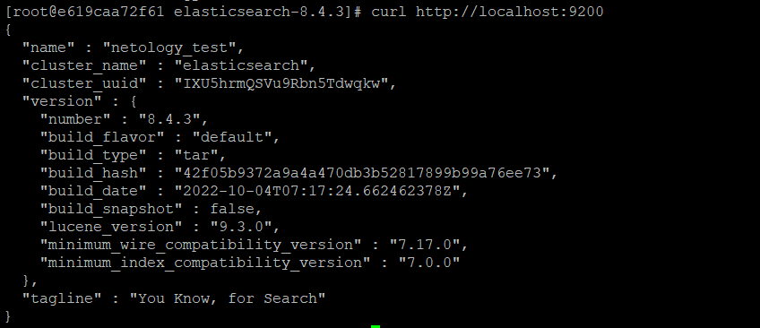
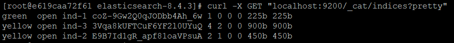
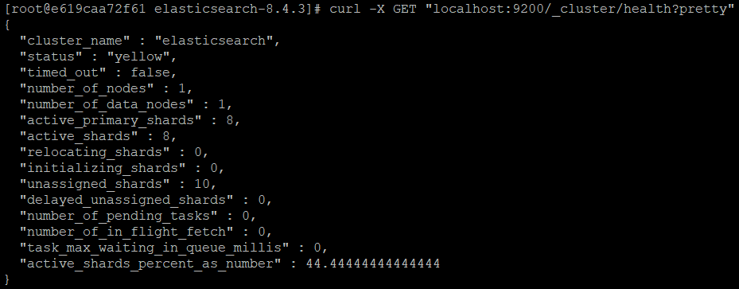
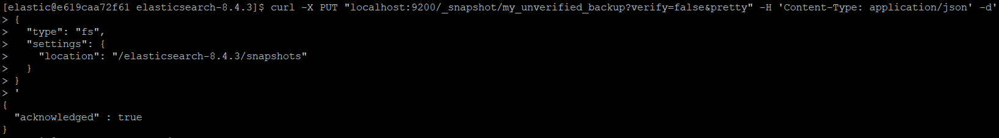
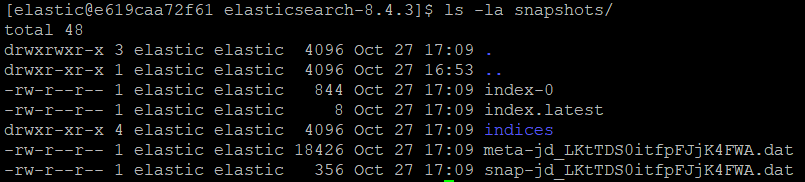

# Домашнее задание к занятию "6.5. Elasticsearch"
1. Dockerfile можно найти [здесь](./dockerfiles/Dockerfile)  
   [Образ](https://hub.docker.com/repository/docker/pavelorlov1/netology-6.5) в dockerhub  
   Ответ ElasticSearch:  
   
2. Список индексов:  
     
   Состояние кластера:  
     
   Некоторые шарды и кластер в состоянии yellow из-за того что не все шарды имеют достаточное кол-во реплик в связи с тем что кластер состоит только из одной ноды.
3. Запрос и результат:  
     
   Список индексов после создания индекса test:  
     
   Список файлов в директории со snapshot'ами:  
     
   Список индексов после удаления индекса test и создания индекса test2:  
     
   Запрос для восстановления и список индексов после восстановления:  
   